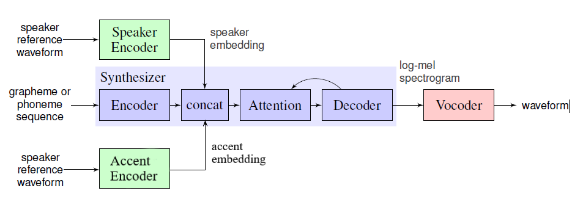

# Accent Preserving Voice Cloning using SV2TTS

## Our goal is to develop a zero shot voice cloning system that preserves accent infromation in the synthesized voice. We are building this based on the work described in  "Transfer Learning from Speaker Verification toMultispeaker Text-To-Speech Synthesis" where they combine a speaker embedding, extracted from speaker verification system, with a synthesizer and vocoder to generate a voice that resembles that of the user. 

## The system from the paper consists of three parts
* Speaker Encoder Network 
* Tacotron based Speech Synthesizer 
* WaveNet based Vocoder 

## Our idea is to incorporate an accent encoding network into the system described above. We plan to implement this proposal as summarized in the following diagram.

## The bottom part of the above figure depicts our accent encoding network. The Accent Encoder works in a similar fashion to the Speaker Encoder. The Speaker network tries to map a sequence of log-mel spectorgram frames, from the speech, to a fixed dimensional embedding vector called d-vector. This d-vector can be used to uniquely identify the speaker. Similarly, we hope to train an encoder that learns an user specific accent embedding, which can be used in an identical fashion to the speaker encoder network in the paper to generate accented speech.

## Planned Timeline:
| Week | Planned Work                                                                 |
|------|------------------------------------------------------------------------------|
| 1    | Identify relevant datasets                                                   |
| 2    | Grouping and Preprocessing data from multiple sources                        |
| 2-3  | Designing the Accent Encoder Model                                           |
| 3-4  | Implement a working model that can encode at least 1 accent on training data |
| 5-6  | Extend the model for multiple accents and generalization                     |
| 6    | Draft Report                                                                 |
| 7    | Final Report                                                                 |
